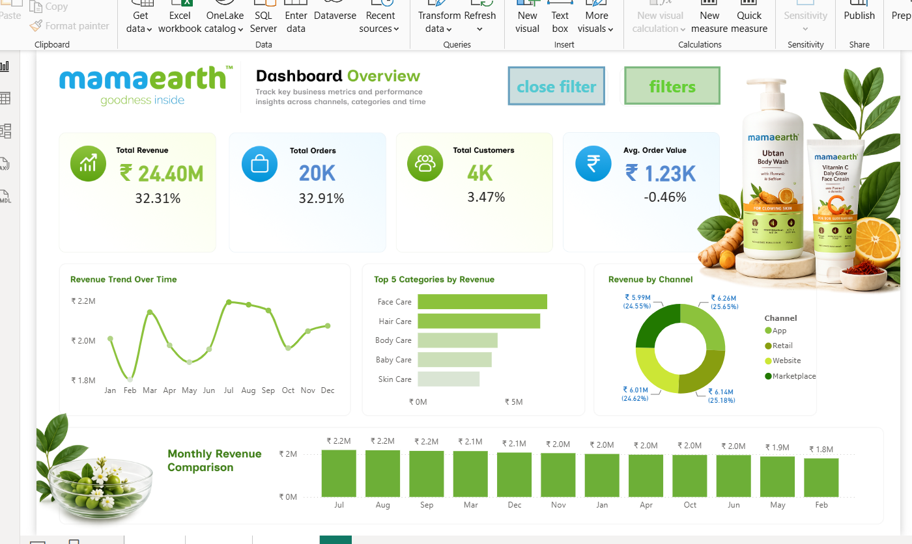

# 🌱 MamaEarth Power BI Dashboard

## 📌 Project Overview

This project is an interactive Power BI dashboard created to
analyze MamaEarth sales data and transform raw data into
meaningful business insights.

## 🛠️ Tools & Technologies

- Power BI
- Power Query
- DAX
- Data Visualization

## 📊 Dashboard Preview

## 🔍 Key Analysis

- Sales Performance
- Product Analysis
- Category Analysis
- Trend Analysis
- Business KPIs
- Interactive Data Visualization

## 💡 Project Highlights

- Cleaned and transformed data using Power Query.
- Created calculated measures using DAX.
- Designed an interactive Power BI dashboard.
- Used KPIs and visualizations to communicate insights.
- Converted raw data into meaningful business insights.

## 📂 Project Files

- `MamaEarth.pbix` — Power BI project file
- `dashboard.png` — Dashboard preview

## 👩‍💻 Created By

**Mansi Porwal**

Aspiring Data Analyst
